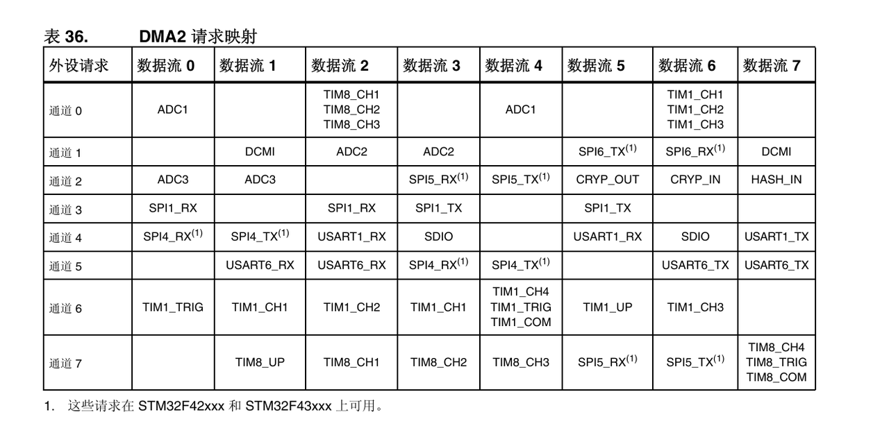
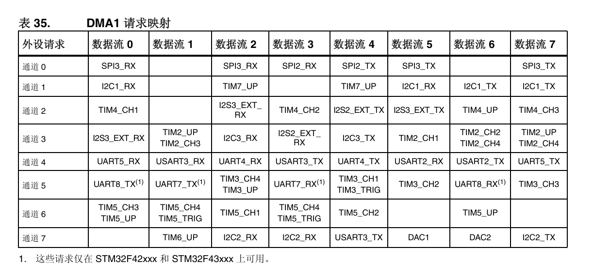

5.40开始

# 任务初步规划（AI辅助）


阶段三：CAN电机控制系统（保持不变）

3.1 CAN通信配置：波特率 (1Mbps), 过滤器, 发送邮箱。

3.2 CAN通信协议：定义电机ID和数据帧格式（例如，DJI电机的 0x1FF 或 0x200 IDL）。

3.3 控制接口：封装CAN发送函数（例如 CAN\_Send\_Motor\_Current(yaw\_current, pitch\_current)）。

阶段四：输入处理与控制器设计（关键优化）

4.1 输入信号处理器（TD）：

目标： 解决“阶跃”输入的“无超调”难题（对应图片“TD补充速度前馈”）。

实现： 在PID之前，加入一个跟踪微分器 (TD) 或斜坡/S型曲线发生器。

输入： 最终目标角度（例如，5°）。

输出： 1.  TD\_Target\_Angle(t)：一个平滑的、连续变化的目标角度。

2. TD\_Target\_Velocity(t)：平滑目标角度的微分，即速度前馈。

4.2 双环PID控制器结构：

4.2.1 位置环 (外环)：

输入误差： Error = TD\_Target\_Angle(t) - IMU\_Actual\_Angle。

输出： 目标速度 (Speed Command)。

4.2.2 速度环 (内环)：

输入误差： Error = (Speed Command) - IMU\_Actual\_Velocity。

输出： 目标电流 (Current Command)。

4.3 前馈补偿：

最终输出电流 = (速度环PID输出) + (速度前馈 TD\_Target\_Velocity(t)) + (重力前馈)。

重力前馈（对应图片5.1 步骤5）：

Pitch轴：必须加入重力补偿。

初级实现： + 一个固定的电流值（用于平衡）。

高级实现： + k \* sin(Pitch\_Angle)，动态补偿重力力矩。

阶段五：系统集成与任务调度（保持不变）

5.1 实时任务划分：

高频 (1kHz)：IMU读取、PID速度环、CAN发送。

低频 (100-500Hz)：PID位置环、TD计算、状态反馈。

5.2 任务调度：使用TIM定时器中断作为主控制“心跳”。

阶段六：安全保护系统（保持不变）

6.1 通信监测：IMU和CAN的超时检测。

6.2 运行保护：软件角度限位、最大电流限制、堵转保护。

阶段七：调试与性能优化（关键优化）

7.1 建立调试工具（对应图片5.1 步骤4）：

必须： 搭建一个上位机实时波形显示（如VOFA+, 匿名上位机, J-Scope）。

目的： 实时绘制“目标角度”和“IMU反馈角度”两条曲线，这是调试PID和满足KPI的唯一高效方法。

7.2 分步调试流程：

验证IMU数据（波形平稳、角度正确）。

验证CAN通信（电机能响应指令）。

单轴调试：

先只给速度前馈，看运动是否平滑。

再加入速度环PID，整定内环。

最后加入位置环PID，整定外环。

7.3 性能优化：

整定TD的参数（最大速度/加速度），在“快速”和“平稳”间取舍。

整定PID参数，消除振荡和稳态误差。

阶段八：系统联调与验证（关键优化）

8.1 性能达标验证（对应图片5.2）：

YAW轴：在上位机发送 5° 阶跃指令。

指标： 响应时间（达到5°）< 100ms。

指标： 超调量必须 = 0%。

PITCH轴：在上位机发送 2° 阶跃指令。

指标： 响应时间 < 70ms。

指标： 超调量 < 2%。

稳态测试：验证阶跃响应稳定后，无静差（如图中黄框所示）。

大角度测试：YAW轴180°大角度运动，全程平稳无超调。

## 任务实际流程图

```c
┌───────────────────────────────┐
│         系统初始化             │
│ - IMU_SPI1_Init()              │
│ - BMI088_Init()                │
│ - UART4_Init_DMA()             │
│ - Gyro_ZeroCalibrate()         │
└───────────────┬───────────────┘
                │
                ▼
       ┌─────────────────┐
       │ 1ms 定时器触发  │
       │ （1 kHz任务）   │
       └───────┬─────────┘
               │
               ▼
       ┌───────────────┐
       │ 云控板任务    │
       │---------------│
       │ BMI088_Read() │
       │  - SPI_Read_Reg() 读取加速度计/陀螺仪原始数据 │
       │  - 减去零偏 gyro_bias[x/y/z]                │
       │  - 单位换算 (ax/ay/az → g, gx/gy/gz → °/s) │
       │  - 互补滤波计算 ROLL/PITCH/YAW             │
       │     • ROLL/PITCH: α*(角+gyro*dt)+(1-α)*AccelAngle │
       │     • YAW: 累积 gyro_z*dt                 │
       │ 填充 IMU_MSG 结构体                          │
       │ UART4_Send_Packet() DMA发送                  │
       └───────┬────────────┘
               │
               ▼
       ┌───────────────┐
       │ 主控板任务    │
       │---------------│
       │ DMA接收 USART2 │
       │  - usart2_rx_buf[32] DMA缓冲区             │
       │ IMU_Data_Parse()                           │
       │  - 检查帧尾 0x00 0x00 0x80 0xFF           │
       │  - memcpy 到 imu_data_rx 结构体           │
       │ 控制算法或显示使用 imu_data_rx.ROL/PIT/YAW │
       └───────────────┘

```

# 实操

### 前置知识

#### DMA映射






## 任务进度

1. 完成串口初始化 SPI初始化 数据包解码

下一步：阅读手册 了解BMI工作原理 初始化BMI 实现原始数据接收 姿态解算 完成云控接收并向主控发送数据任务

* 完成BMI 串口 SPI初始化 数据处理 零飘标定 姿态解算等基本函数

下一步：理解零飘标定 姿态解算原理 设置任务 实际初始化 帧率检测等 建立接收数据完整认识

* 基本理解上述任务

下一步：创建实际任务 实际初始化 再次总结整合 进行can通信控制电机代码任务 （11.9完成 11.8 9.00下班）

11.9 12.30

keil添加文件问题 解决方案：使用vscode新建 补充代码 在keil里添加已存在文件即可

* 写云控接收imu任务 不太懂零飘标定和imuread函数中时间参数的意思 调试云控接收数据&#x20;

问题：不会插线。

去做线区找对应插头 看板子原理图 自己做线 成功

问题：收不到数据 BMI初始化未成功

1 引脚不对应 看原理图

2 GPIO CS引脚未初始化&#x20;

3 BMI初始化中读写逻辑不太对

问AI更改后没什么用。。

`acc_id_val` = 0，`gyro_id_val` = 0  读取ID任务判断出SPI通信不正常工作

调试：

1. 写云控发送数据包给主控任务 写主控解析任务

## 教训

一步一调试 不要相信AI 对自己的代码负责 自己的每一行都要明白是什么意思 正确与否

